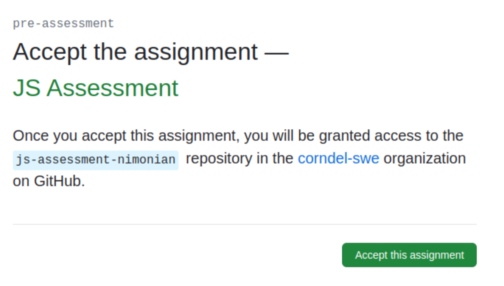
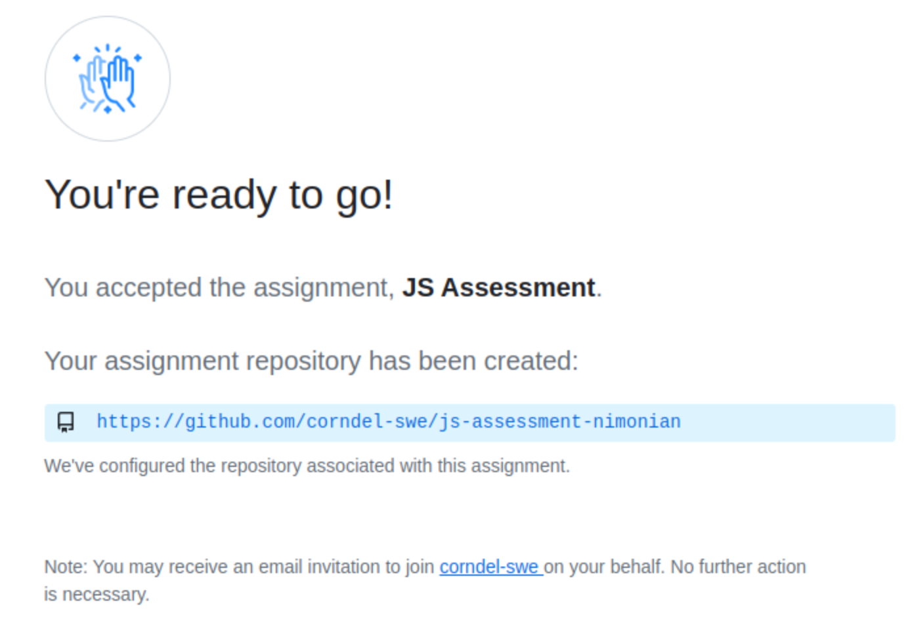
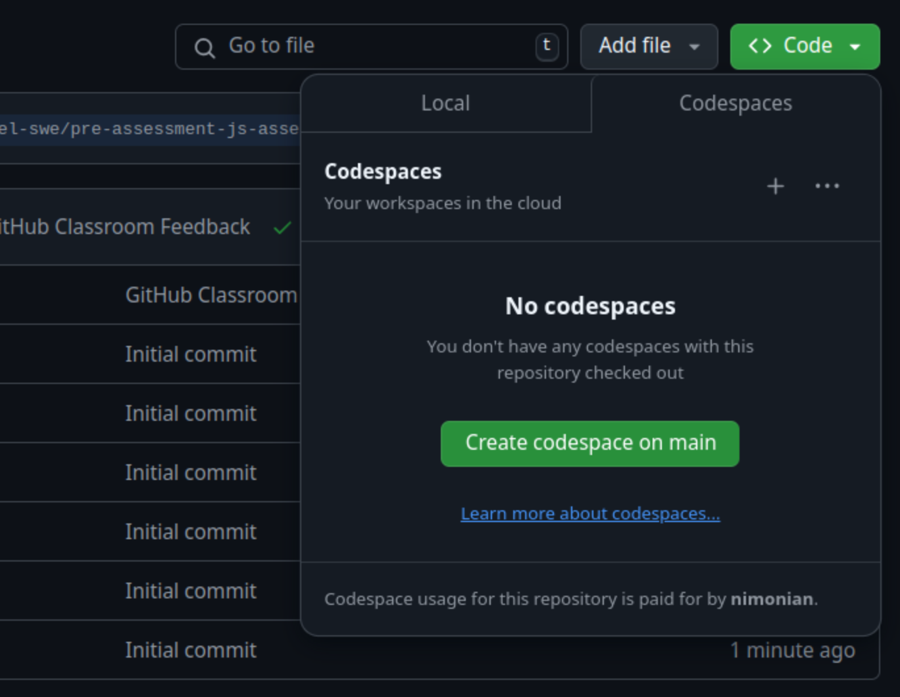
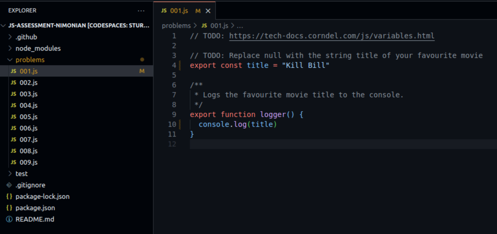
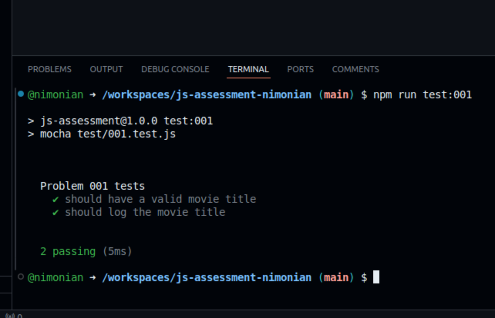
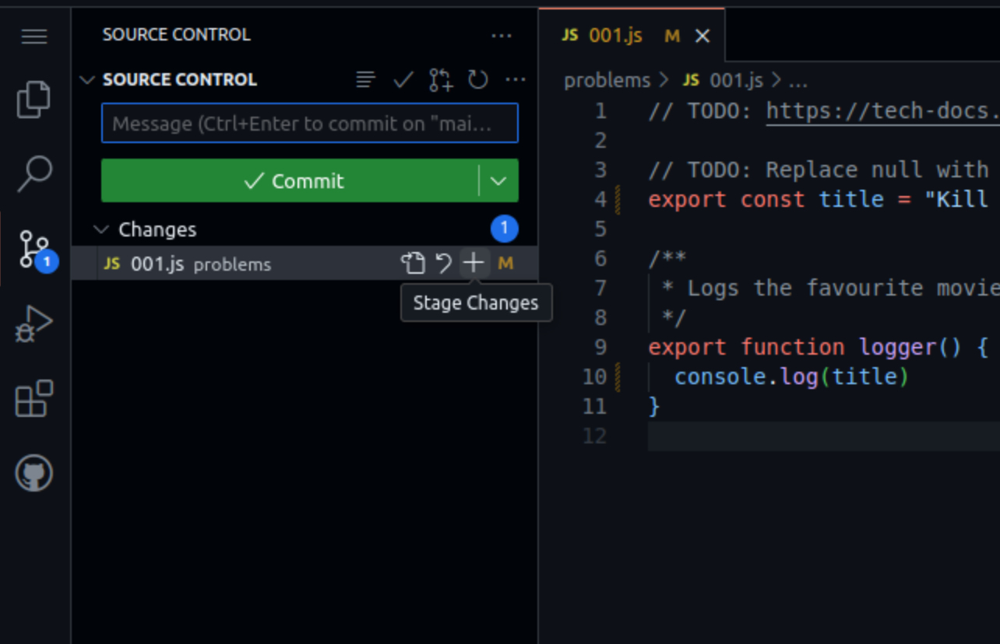
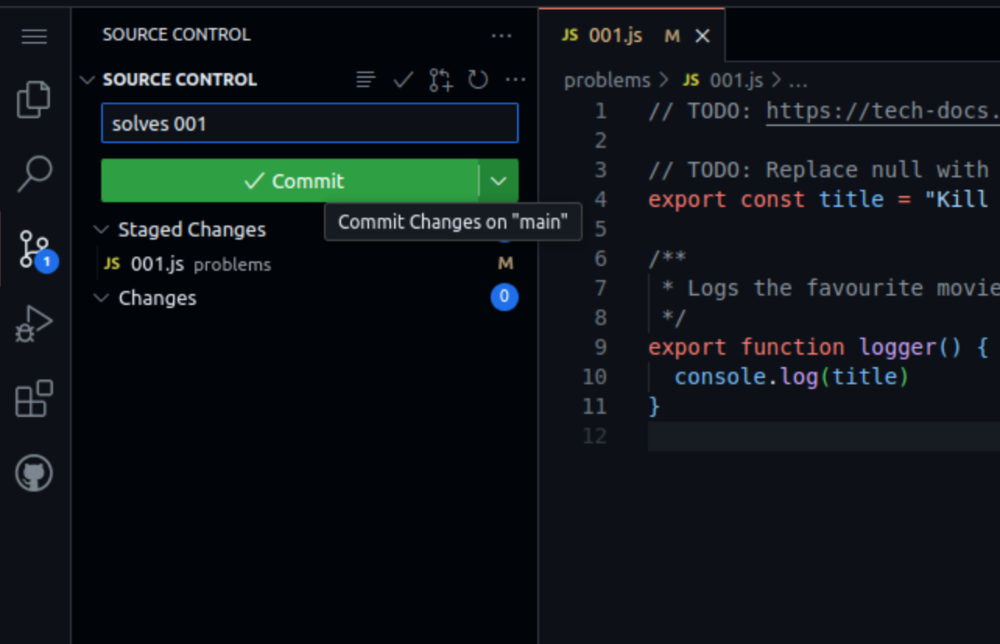
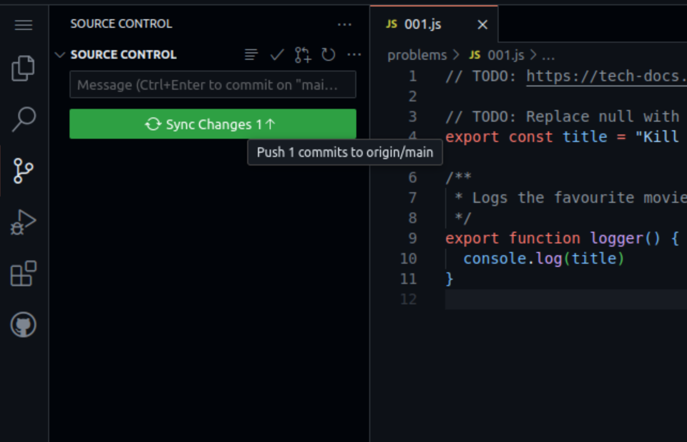

# JavaScript Assessment

Welcome to the Javascript Assessment!

What you are looking at right now is called a _repository_. A repository is a
collection of files containing code, configuration and other things which all
work together to make a piece of software function correctly.

## Problems

In the folder called `problems`, you will find some files which look like
`001.js` and so on. Your task is to try and make all of the code in those files
work correctly.

## Tests

How do you know when the code works correctly? When it passes the tests!

You can run the tests by opening the terminal and running `npm run test:001`,
and so on.

You will see some information in the terminal to show you if your code passes
the tests, or a hint about why it's failing.

> [!TIP]
>
> You can run all of the tests for every problem in one go by running
> `npm run test`.

## Saving your work

In order to save your work, you will need to _commit and push_ your code.

> [!CAUTION]
>
> If you close the browser without committing and pushing, you might lose your
> work.

See the walkthrough below to see how to commit and push your code.

## Walkthrough

Let's walk through the steps to solving, testing, committing and pushing the
first problem.

### Step 0: Open the assignment

When you follow the assignment URL you will see a screen like this:

You open the repo by visiting the link shown in blue:

Then, you should be looking at the project's README (this file)!

### Step 1: Open a codespace

Just above this README, on the right, you will see a green button that says
`<> Code`. Click it, switch to the Codespaces tab and click "Create codespace on
main".

### Step 2: Edit some code

Opening the `problems/001.js` file, you will see some information to explain
what you need to do.

At the top of the file, you will see a link to a video which explains a bit
about the concepts you'll need in order to solve the problem.

### Step 3: Testing a problem

At the bottom of the editor, you will see a terminal window. Click in the
terminal, type `npm run test:001` and hit enter.

If all goes well, you will see lots of green. If something still isn't passing,
there will be some hints as to what is going wrong.

### Step 4: Staging changes

Click on the "Github" tab on the left. It looks like three dots connected by
railway tracks.

Click the little `+` symbol to stage all changes.

### Step 5: Committing the changes

After staging the changes, you should see that a green button invites you to
commit.

Type a short message explaining what changes you have made to the repository,
then click the commit button.

### Step 6: Push changes

After committing, the button should change to say "sync changes".

Click this button to save changes from Codespace back to the repository on
Github.

## FAQ

### Can I look at the test folder?

Yes! It's totally fine. But **don't change anything in the test folder**, treat
it as read only.

### Oh no I changed the test folder...

It's ok! Just hit `Ctrl + Z` a bunch of times to undo all your changes.

### I chagned the test folder and `Ctrl + Z` isn't helping...

Don't worry! Remember the "Github" tab from Step 4? Open it up and you'll see a
list of all files that have been changed. Look for the "revert" button (it looks
like an "undo" symbol). It should restore the file to its original state.
